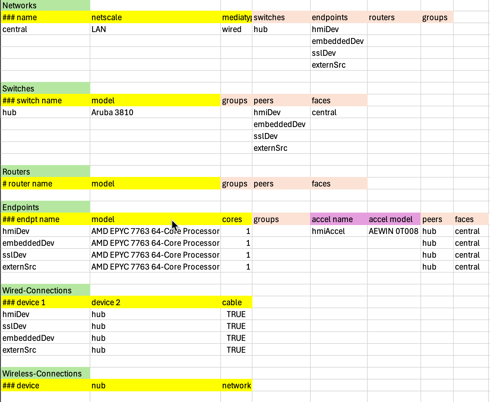
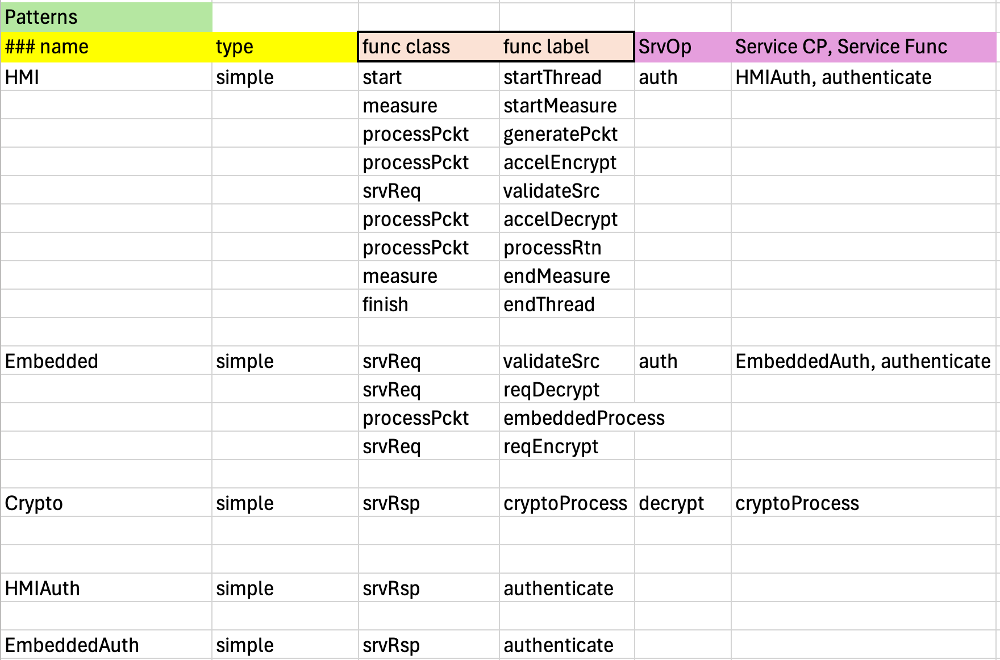
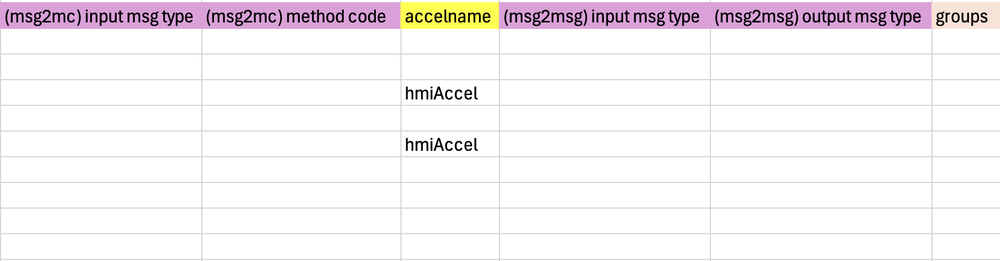
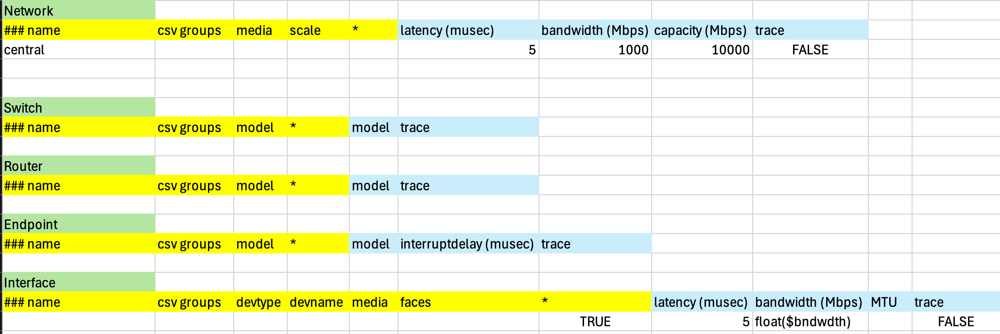
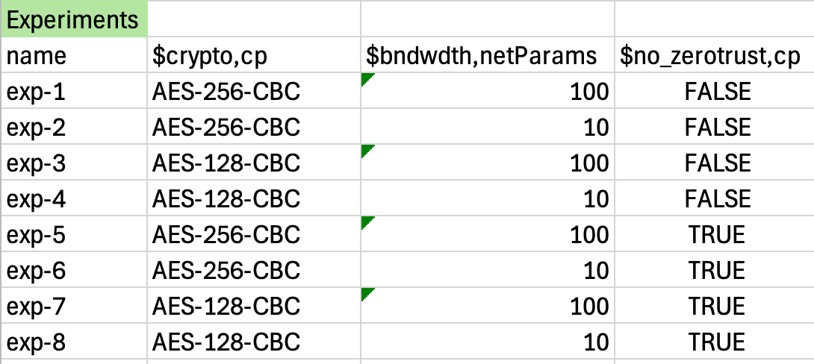
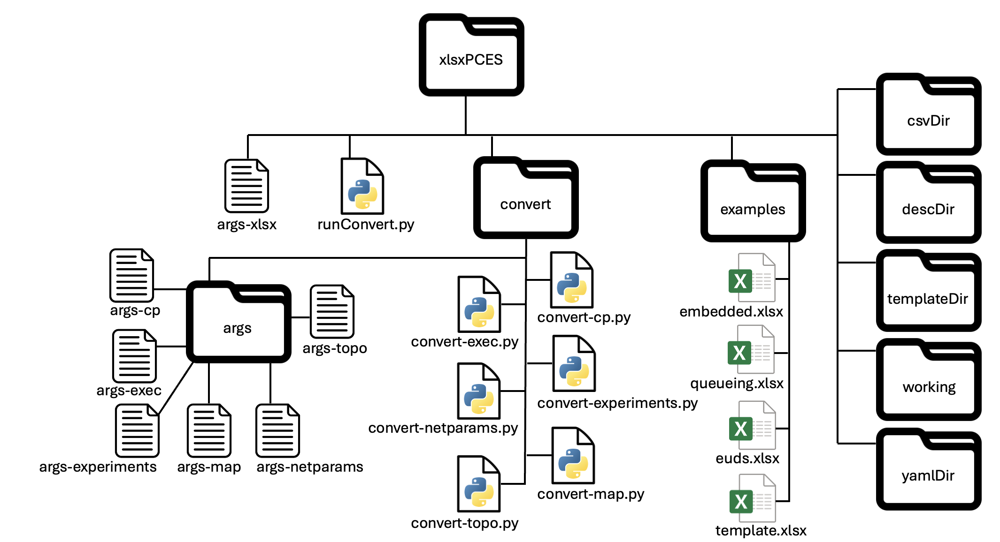

### Building a PCES model 

(last update May 17, 2025)

#### xlsxPCES

xlsxPCES is an application that uses an xlsx-formated spreadsheet to define entities in a PCES model, define their relationships and parameters, and then have a complete set of PCES input files created that will run an experiment.

The distributed format assumes that a single spreadsheet with several sheets is the input.   Those sheets are individually peeled off and converted to .csv form, which means that with very little tinkering to the distributed code one could start with a separate .xls file for each sheet, or even start with separate .csv files created by some other tools.    For each such .csv file there exists a python script that uses the information expressed to build one or more particular **pces** input files.   These scripts create auxiliary files containing information that can be used by other scripts in the family to help perform sanity checking on the entries embedded in the .csv files and their relationships with other entities.

The source code for the xlsPCES system is available through github.com/iti/pcesbld.   The python script that separates different sheets into .csv files expects two packages to have been installed, 'pandas', and 'openpyxl'.

To use xlsxPCES one should obtain the code at github.com/iti/pcesbld.  The package has subdirectory *xlsxpces*, which contains subdirectories *convert*, *examples*, and *template*.  Subdirectory *convert* holds the python scripts involved into the tools execution, examples holds examples of xlsx projects (including xlsx file and output files), and *template* holds a blank xlsxPCES input file *template.xlsx* that can be copied and filled out for new projects.   

The script that coordinates the xlsx -> pces transformation is *pcesbld/xlsxpces/convert/runConvert.py* .   It has up to eight command-line parameters:

| flag         | argument type       | explanation                                                  | required |
| ------------ | ------------------- | ------------------------------------------------------------ | -------- |
| -name        | string              | Name for system model                                        | yes      |
| -argsDir     | File directory path | Directory for conversion scripts arguments. Absence forces use of default. | no       |
| -csvDir      | File directory path | Directory where scratch .csv files extracted from .xlsx file are placed | yes      |
| -yamlDir     | File directory path | Directory where yaml **pces** input files are written as xlsxPCES final output | yes      |
| -descDir     | File directory path | Directory for scratch auxiliary files used to validate input | yes      |
| -workingDir  | File directory path | Location for various other scratch files                     | yes      |
| -convertDir  | File directory path | Directory for python conversion scripts. Absence forces use of default. | no       |
| -templateDir | File directory path | Directory for scratch .csv files with symbolic variables     | yes      |
| -xlsx        | Path to file        | Location of input .xlsx file                                 | yes      |

***Table 1: Command-line arguments for runConvert.py script***

These may be written, one per line, into a file that can be passed rather then all the parameters on the command-line, e.g., (from the home directory *pcesbld/xlsxpces*)

```
% python3 runConvert.py -is args-xlsx
```

The *xlsx-args* file included in the distribution references an empty template .xlsx file (and so must be changed), and references default subdirectories for the result of the arguments that are all subdirectories of  *pcesbld/xlsxpces*, e.g., *descDir*, *resultsDir*, *csvDir*, and *working*.  We will later see that building models within the *pcesapp* repo framework limits the number of choices a user has to make to (a) giving the model a name, (b) identifying the path to the input xlsx file, and  (c) identifying the path to the directory where the files produced as the tool's output are written.

Once the **pces** input files are created there is no need to remember the .csv files (provided of course that the input .xlsx file is retained).  The auxiliary files written into the -descDir location aren't used directly by **pces**, but may be useful to auxiliary functions such as a graphical user interface.   

#### xlsxPCES Execution

*runConvert.py* starts with sanity checks.   Ideally all the paths given in the input arguments exist (and their existence is checked), but *csvDir*,  *descDir*, and *workingDir* are entirely temporary, and so if the values given them on the command-line don't map to existing directories, temporary scratch directories are created for them.

Next *runConvery.py* converts the input spreadsheet with several sheets into several .csv files, one per sheet. These are written into the *csvDir* directory.  If the '-build' option is absent the script exits, having done all that was asked of it.  The more usual case is when '-build' is set.    One of the most useful features of xlsxPCES is the effort it puts into validating the expression of the model.   We will see more of this when stepping through the running example.  But the validity of a model depends on all of its parameter values, and .csv files with symbolic variables don't admit immediately to verification, because some assignment of values to those variables may result in valid models, and others not.   Correspondingly xlxsPCES works through every assignment of values to variables that are expressed in the 'experiments' sheet, essentially creating the full set of parameters for every run, and for each such set validate it.

Now the .csv files containing symbolic systems are in *templateDir*.  To create a set of .csv files that are fully instantiated for a given run, script *runConvey.py* takes each, applies the string-to-string transformation required for assignment of values to symbolic variables, and deposits the results in the scratch directory *csvDir*. Next, for each sheet (and in a particular order required to satisfy certain dependencies) a python script tailored for that sheet is run.  These scripts are found in the directory pointed to by the '-convertDir' command-line arguement.  The argument file for that script is created by *runConvert.py* as a combination of some arguments that are common to all the conversion scripts, and others that are specific to the script, and is written into scratch directory *workingDir*.  The validation checks for some scripts are aided by the creation of additional data structures that result from analysis of .csv files analyzed earlier.  When a conversion script creates this kind of file it is written into the scratch *descDir* directory.

If the 'experiments' sheet identifies that there are N runs to be performed, this process of creating a fully instantiated set of .csv files and analyzing the set of them for validity is repeated N times, but without creating .yaml output files.   So then if all N runs are validated properly, in a last transformation the conversion scripts create .yaml files from the .csv files with embedded symbolic variables, and the resulting files also carry these symbolic variables.   This final set of files is written into the directory identified with the '-yamlDir' flag in *runConvert.py*'s argument file.

#### A Running Example

We will describe the various components of the xlsx input description using it to describe a running example.  We emphasize up-front that the intent of the example is far more to illustrate the functionalty of the xlsxPCES modeling tool than it is to represent a system of interest.  Figure 1 below identifies the model's computation patterns as grey enclosures with names 'HMI', 'Embedded', 'HMIAuth', 'EmbeddAuth', and 'Crypto'.   The big picture is that code within the HMI grouping generates a request for some computational service from code in the Embedded group, receives a response, and processes it.  There are a lot of functions in the figure contributing to this seemingly simple task, illustrating that from modeling point of view the devil is in the details.

The blue boxes represent functions, and the labels within those boxes are the labels the model uses to refer to those functions. Labels are unique within a computational pattern, but the same label may be used by different functions in different computational patterns, e.g., here, both HMI and Embedded have functions with the label 'validateSrc'.   It may be that the code these represent is identical, but that detail would be completely incidently to the **pces** point of view.

The red arrows indicate stated input/output relations between functions, and the text on the edges identify so-called 'message types' that place a key role in executing the simulation.


***Figure 1: Computational patterns and functions in running example***

An experiment starts with the execution of function 'startThread' in HMI.  The first two functions establish some bookkeeping, the 'generatePckt' function simulates creation of a request of some computational service, which is passed to the function 'accelEncrypt' that models encryption that request, using a cryptographic accelerator function in the host that performs that task.   The encrypted message is passed then to the function 'validateSrc' in the 'Embedded' computational pattern.  The idea here is to model the sort of 'every message' edge-based authentication as is proposed for zero-trust architectures.  Not seen in this diagram, the 'validateSrc' function engages with authentication logic in the 'authenticate' function of the 'EmbeddedAuth' computational pattern.   Following validation the message is passed within 'Embedded' to the 'reqDecrypt' function, which (again not expressed explicitly in this diagram) has the 'cryptoProcess' function of the 'Crypto' computational pattern perform the decryption.  The now-decrypted message is passed within 'Embedded' to the 'embeddedProcess' function which performs the requested computational work, and then passes the result to the 'requestEncrypt' function, which requests that function 'cryptoProcess' in 'Crypto' perform the encryption, and on completion, passes the message back to HMI, where it is received by  HMI's 'validateSrc' function.  This works just as did the function of that name for Embedded, the message is passed to HMI's function 'accelDecrypt' which uses the on-board accelerator to decrypt the message.   It is then passed to function 'processRtn' which ruminates on the result of the requested computation, and finally the message passes through 'endMeasure' and 'endThread' where the bookkeeping for this execution thread is finished.

#### pces Function Evaluation 

<a name="function evaluation"></a>

To understand some particulars of a **pces** model contained in the xlsx expression it is necessary to understand what the **pces** simulator does to pass a message through a function.   To begin with, one needs to understand that every function has some *class*, an attribute that impacts function operation and definition of the configuration parameters that function requires.  **pces** defines the function classes, we will spend considerably more time later seeing how function class impacts the function's configuration parameters.  Function class is important at one point in the process involved in handling an input message.

Our discussion starts at a point where we can assume that the identity of a function (and all of its configuration parameters) is known, and that a message has been presented to pass through that function.   A function may have more than one subroutine associated with it, with different choices bound to different operations the function might model.   Indeed, the subroutines available to the function depend on the function class---all functions of the same class have access to the same response subroutines. 

The **pces** approach is to use the 'message type' field of the inbound message to determine which response should be applied, i.e., which of the possible subroutines should be called.   Figure 2 below identifies the steps and some of the function configuration variables that are involved in this decision.   Knowing that a model may support more message types than it will particular subroutines to call in response to receipt of a message, **pces** requires almost all function classes to be configured with a dictionary that xlesPCES identifies as 'msg2mc'.   Each function has its own distinct 'msg2mc' dictionary. The key to the dictionary is the message type field of the input message, the value mapped to is a string we call a 'method code'.  The dictionary approach allows many message types to map to the same method code, as appropriate.

Next, the function has a 'RespMethods' dictionary. Given the that dictionary and the method code, **pces** looks up the identity of a response method to call, passing along as input the inbound message.  The response method executes, and does two important things.   One is to introduce a simulated processing time delay associated with the response, the other is to choose the function to next be given the message.  To include a timing delay, the response method looks up an operation code from the function's 'timingcode' dictionary that will be known to the table of function timings.    The message type of the inbound message is the key to the lookup, and the result returned is an op code for use in execution time lookup.  Other parameters to the function execution time lookup include the model of the processor assumed to be executing the operation, and the length of the message being processed.   The response method then schedules a time in the future to simulate the completion of the simulated operation.    When *that* subroutine executes, it chooses the destination function and message type to place on the forwarded message.   If it happens that in the computational pattern graph view of the functions there is exactly one output edge, then the destination function and the message type are extracted from the graph.   If instead there is more than one output edge **pces** selects among the options by the expedient of using a dictionary bound to the specific function, called 'msg2msg', which encodes a transformation of the type of the inbound message (the msg2msg key), to another string which will be used as a message type.  That string, say, 'outMsgType', will appear as the edge label on one of the multiple edges departing the function.   The edge chosen (and hence the destination of the forwarded message), is the one whose message label matches 'outMsgType'.


***Figure 2: Steps in evaluation of function***


#### The input spreadsheet

We now consider how to express this system using an .xlsx spreadsheet.

The names of sheets in an xlsxpces spreadsheet are 'topo', 'cp', 'execTime', 'mapping', 'netParams', and 'experiments'.   *convert-xlsx.py* converts these into files 'topo-sheet.csv', 'cp-sheet.csv', 'exectime-sheet.csv', 'mapping-sheet.csv',  'netParams-sheet.csv', and 'experiments.csv'.   Then, if the -build command-line argument was provided, it calls python scripts found in *pcesbld/xlsxpces/convert*, in a particular order.   Each script transforms one of the sheet's .csv files.   The order of application is

1. *convert-experiments.py* to convert file 'experiments.csv' into **pces** input file 'experiments.yaml'.
2. *convert-exec.py*, to convert file 'execTime-sheet.csv' into **pces** input file 'funcExec.yaml'.
3. *convert-topo.py* to convert file 'topo-sheet.csv' into **pces** input file 'topo.yaml'.
4. *convert-cp.py* to convert file 'cp-sheet.csv' into **pces** input files 'cp.yaml' and 'cpInit.py'.
5. *convert-map.py* to convert file 'map-sheet.csv' into **pces** input file 'map.yaml'.
6. *convert-netparams.py* to convert file 'netParams-sheet.csv' into **pces** input file 'exp.yaml'.

The reason for the order is to enable scripts that are earlier in the sequence to create and store auxilary data structures that can be used by scripts later in the sequence to aid in model validation.  For example, in 'exectime-sheet.csv' we find the op codes for operations that have been timed, and whose timings may be used in the course of the **pces** model evaluation.    Those same codes appear on other model sheets, e.g., in 'cp-sheet.csv', and so to enable *convert-cp.py* to perform validation checks on the strings written into cells reserved for these op codes, we have *convert-exec.py* create a file that identifies legitimate op codes for use by *convert-cp.py* .

We next turn to observation and discussion of the individual .xlsx sheets.

##### execTime sheet

The execTime sheet holds descriptions of function timings.   An example of the sheet is given below.


***Figure 3: execTime sheet in running xlsxPCES model***

The sheet defines four categories, with identifying names in green, 'CPU Entries', 'Accelerator Entries', 'Router Entries', and 'Switch Entries'.  The reason for the separation is that different kinds of devices have different operations, and so we expect the 'operation' column for rows of a given category to refer to operations for which we have timings for that kind of device.  Otherwise the layouts of each category are the same.   

First of all, note that a row where all the columns are empty is ignored.   It is not required as a separator for parsing, although including an empty row may aid visual inspection.  Also, when the first cell of a line begins with the character '#', that entire line is viewed as a comment; the example's use of '###' is stylistic, only the first character matters to the parser.   For the entry category the comments are the same, labeling the columns to indicate a string identifying the model of the device, a column in which one finds strings identifying op codes for which we have timing data.

For entries in the 'CPU Entries' and 'Accelerator Entries' categories the exection time for a given operation on a given device model is specified in micro-seconds, as a function of the packet length.   When a timing is required for an operation on a packet whose length is not found on the table, the time is taken to be a linear interpolation between the timings of the closest two packet lengths that bracket it, or by extrapolation if the packet length falls outside of the range of packet lengths that are listed.

For Switch and Router entries the timing (in column 'exec time') gives measured (average) time for the operation, as a function of the packet length and interface bandwidth values given in columns 'pcktlen' and 'bandwidth'.   If the simulation is using packet lengths and/or bandwidths that are not represented in the table, the estimated time of the operation is computed by linear interpolation. 

The color key identifies green as designating a category,  and the code words serving as categories matter. Processing script *exec-sheet.py* scans the lines of a .csv representation of this form,  and notices when it encounters strings that are marked here in green.   This serves to categories the models and operations listed in lines that follow as being associated with the kind of device associated with the category.

The color key identifies yellow as denoting a 'singleton descriptor'.  By this we mean that cells in a column whose designating comment color is yellow are single cells, to be distinguished from cells involved in defining lists or dictionaries.     There are no lists or dictionaries in an execTime sheet.

In reviewing the actual entries in this table, we see model identifiers that look 'real', and indeed are names of CPUs and switches we have in the ITI testbed.  The only operation we list for a switch is the 'switch' operation.   The CPU entries have codes for cryptographic operations, expressed using the format 'operation-algorithm-keylength-ciphermode'.   They also list some operations the user defined, and timed, e.g., 'authenticate', 'packet-generate', 'packet-return', and 'packet-process.'   

These operation codes also appear in cells on other sheets of the .xlsx model, and it is critical to validate that when an operation code is given in a different sheet that it refer to an operation code found on this sheet, else a run-time error will occur when an unrecognized operation is presented for timing interpretation.  

##### topo sheet

The topo sheet holds a description of the topology of the devices and networks referenced in the simulation model.  The model entities and attributes related to the **mrnes** package imported by **pces**.




***Figure 4: topo sheet in running xlsxPCES model***

This sheet has six categories, one to describe networks, three to describe devices that are embedded in networks, and two related to connections between devices in those networks.

A **mrnes** model may have multiple networks.   All these will be described in the network category, each will have listed some attributes (to be discussed) that may require more than one row to completely describe.   The parser will understand that the description of one network has ended and a new one begun when it encounters a 'name'  that is different from the network name last given in a non-empty cell in the first column.  This is a clumsy but precise way of saying that one can list the network name just once, on the first row associated with the network, and the binding of row to network can be inferred when the cell in first column is empty.   The 'netscale' of the network (2nd column) must be drawn from {'LAN', 'WAN', 'T3', 'T2', 'T1'}.  The 'mediatype'  (third column) must be drawn from {'wired', 'wireless'}.  The name, scale, and mediatype need only be listed once per network, on the first row.   Likewise the 'groups' attribute string appears at most once.   It may be empty; it holds a comma-separated list of group names, understood to denote membership of the network to the "group" of entities associated with that group name.   Group names and their appearance through the **mrnes** model are completely user-defined.   The 'group' cell on the first row of a network description can be empty.

A network description also gives lists of names of switches, endpoints, and routers.  Note that here we embed a list in the spreadsheet, spreading the list members across adjacent rows in a common column.  The values in the cells corresponding to the list of switches must each appear in the 'name' column (0) in the Switches category; likewise for Endpoints and Routers.   The model in this example has one hub, three endpoints, and no routers.

The attributes of a Switch are listed within the Switches category, being the switch name, the model of the switch device,  and groups the switch may be associated with.   All of these attributes are singletons, expected to appear exactly once per switch in the Switches category.    Transitioning from rows associated with one switch to rows associated with another works exactly as it does for networks:  the appearance of a new (non-empty) value in column 0 within the Switches category signals the beginning of a new switch description.    A switch has two attributes expressed as lists.  A device that connects to the switch is referred to here as a 'peer' of the switch.   Peers will be other switches, routers, and endpoints, and the list of peers is a list of their names, which are assumed to appear on this sheet, in column 0, where the description for that device is introduced.      The 'faces' attribute is based on the nomenclature that an interface on a switch 'faces' a network if it connects to another device in that network.  While normally all of a Switch's interfaces face the same network, here (mostly for symmetry with routers) we allow for a list of networks. The groups cell may be empty, we expect that the 'peers' and 'faces' lists will both be non-empty.

Routers described in the Routers category have precisely the same understanding as do Switches of the columns defining their attributes.

For an Endpoint in the Endpoints category the 'name',  'model', 'groups', 'peers', and 'faces' attribute columns are exactly as defined for Switches and Routers.   With an endpoint though we have the option of specifying  the number of CPU cores available (in column 'cores').   If this cell is empty the number of cores is taken to be 1, any other entry must be a positive integer. An endpoint may also include reference to one or more hardware accelerators, e.g., for hash computations.    The 'accel name' and 'accel model' columns can be used to map a dictionary key (the name) to a dictionary value (the model).  For a given endpoint these two columns may extend through multiple adjacent rows, always sharing the same length.

The 'Wired-Connections' categories describe which pairs of network devices connect to each other using wired connections.  The 'device 1' and 'device 2' columns expect strings previously placed in some device's 'name' column.   The boolean 'cable' column is used to indicate whether there is a direct cabled connection between the two devices, with no intervening devices (like a switch) between them, expressed *in the model*.   For example, a user may create a model where every host in a LAN connects directly to a switch, which enables every host to connect with every other host in the LAN.   Every host-switch connection would be documented, 'TRUE' in the cable category.   But it might also be that the user wishes to specify that host h1 and host h2 are connected, but not with a direct cable from one to the other.  In this case the user leaves the 'cable' column blank (or puts in FALSE), device 1' would be the name of one of the host, 'device 2' the name of the other, and the 'cable' column would be false.  The choice impacts how latencies and bandwidths are computed during a simulation.   A 'cabled' connection is taken to imply dedicated network interface cards at both ends, fixed and dedicated bandwidth to that connection at both ends, and a fixed on-wire latency for a bit traversing that cable.  A non-cabled connection bases latency and bandwidth on traffic load on the network and through the interfaces.  The calculation assumes that a host has only one network interface connected to that LAN.

The 'Wireless-Connections' categories describe the hosts on a wireless LAN, and a wireless hub to which the host connects.   It specifies the network (named earlier in the sheet) involved in that connection.

#### cp sheet

The cp sheet identifies the **pces** functions a modeler introduces into a model, their input/output relationships, and the values of configuration parameters required to fully describe the functions and their behaviors.    The cp sheet has three categories.   The 'Patterns' category names functions and organizes each within a 'Computational Pattern'.  The 'Connections' category specifies input/output relationships between functions, and the 'Initialization' category identitifes for each function the values of parameters the **pces** simulator assumes are present as it conducts the simulation.    Each function belongs to a particular **pces** 'class', and the particular attrributes required for the function are class-dependent.    The 'Initializations' category is subdivided into classes, with all functions of a given class having their configuration parameters specified within the same subdivision.

##### Patterns Category

The graphic below illustrates an example of the 'Patterns' category.



***Figure 5: Patterns category in cp sheet of running xlsxPCES model***

A 'Computational Pattern' is a loose association of functions; the elements of this category each describe a computational pattern (or sometimes, CmpPtn).   Each CmpPtn has a unique name, which appears in the column 'name'.   A CmpPtn is identified to belong to a 'type', although this designation is included to help organize representation of a CmpPtn in a database and plays no further role in the specification of the model.   The adjacent columns 'func class' and 'func label' hold descriptions of functions, the class to which they belong, and their 'label', which is a unique (within a CmpPtn) identifier for the function.  These two columns contain a list of class-label pairs.  In the example above the CmpPtn named HMI contains nine functions.  These have unique (to the CmpPtn) labels;  the codes in the 'func class' column are drawn from the set of function classes {'start', 'measure', 'processPckt', 'srvReq', 'srvRsp', 'transfer', 'finish'}.  The 'name' and 'type' columns for a given CmpPtn may remain empty for rows other than the first.  As with earlier sheets, the appearance of a non-empty value in the 'name' cell which is different from the previous most recently encountered 'name' cell value is taken by the parser to indicate the beginning of a new CmpPtn description.

As described in the **pces** overview documentation, a CmpPtn may offer a dictionary whose keys are codes for so-called 'services', and the value associated with a service is the identity of a function that provides that service.   The figure above declares that the HMI CmpPtn has a dictionary with one service offered, 'auth', which is provided by the function with label 'authenticate' embedded in CmpPtn 'HMIAuth'.  To simplify expression we have a service function resident in a CmpPtn *different from* the one specifying the service offering to list the CmpPtn-label pair by a comma-separated string with CmpPtn name given first.   If the CmpPtn of the offered service is the same CmpPtn, then no specification of the CmpPtn is needed in the string to which the service code is mapped.    For example, note that CmpPtn 'Crypto' offers two services, 'encrypt' and 'decrypt', and the absence of a comma in the service function column indicates that the named functions (cryptoProcess for both services) belong to 'Crypto'.

This table identifies relationships that must be reflected elsewhere in 'cp-sheet.csv' and in other sheets.   References to the names of CmpPtn and to labels of functions they contain must all appear in the 'Patterns' category declarations.   When functions and their classes are referenced elsewhere, those references must be consistent with those in the 'Patterns' category declarations.    Each of the functions named in the 'Patterns' category declaration must its configuration parameters specified later the 'Initializations' category of 'cp-sheet.csv'.    The functions named in the CmpPtn service dictionaries must be defined in the CmpPtn explicitly or implicitly identified in the string that describes the function that provides service.   Elsewhere in the model reference can be made to a specified service offered by a CmpPtn,  and that reference must be found in the 'Patterns' description for that CmpPtn. 

##### Connections Category

Entries in the 'Connections' category describe the input-output relationships between functions.  Typically, but not exclusively, the output of a function is the input to a function in the same CmpPtn.   Every  connection that is made identifies the CmpPtn name and label of the source function, the CmpPtn name and label of the destination function, and a 'message type' that is afixed to the message before delivery to the destination function.  The graphic below illustrates the connections from our running example.


***Figure 6: Connections category in cp sheet of running xlsxPCES model***

As there are no lists or dictionaries associated with a connection entry, each individual row describes a unique connection.  Every CmpPtn-label pair identified as source or destination will have been previously identified in the 'Patterns' category.  The careful reader may notice that the CmpPtns 'Crypto', 'HMIAuth', and 'EmbeddedAuth' do not appear anywhere in the 'Connection's category.   To be sure the model provides connections to their functions, but expression of those connections occur in specialized contexts and don't require expression here.   

The expression of message labels defines the existence of those labels,  whose values appear in multiple other places in the **pces** model.

##### Initializations Category

Each of the functions we use need to be configured with parameters that impact their behavior.  The specification of these configurations are gathered in the 'Initializations' category.   The parameters a function requires depend on the function class.  The classes are given in the table below.

| Function Class | Explanation                                                  | Default method codes           |
| -------------- | ------------------------------------------------------------ | ------------------------------ |
| start          | Used to initiate the beginning of an execution thread        | "default"                      |
| finish         | Used to signal the completion of an execution thread.        | "default",  "finishOp"         |
| measure        | An execution thread may encounter a number of 'measure' functions on its route. Each records the elapsed time since the execution thread began. | "default", "measure"           |
| processPckt    | Receives an input message, simulates the timing delay associated with processing that message, and pushes the message along to another function. | "default", "processOp"         |
| srvReq         | Used to request some computational service from a specified server | "default", "request", "return" |
| srvRsp         | Simulates the computational delay associated with the computation associated with providing a requested service | "default"                      |
| transfer       | Used to forward an input message to some designated receiving function, provides more generality for expressing input/output relationships than just a Computational Pattern Graph. | "default"                      |

***Figure 7: pces function classes***

We also include the class-dependent list of 'method codes' that the out-of-the-github-box version of **pces** contains.  These place a key role in defining a function's response to an incoming message.   In another document [User-Extensions](#) we describe how a user can extend **pces** out-of-the-box behavior to include details that are special to the model, and/or should not be publically available through github.  Part of that extension can include additional entries into the tables indexed by the method codes.

As a final preliminary note, we point out that in the initializations to follow, every function can be tagged with list of arbitrary 'group names' that are defined by the user.  One can think of these as user-defined group labels applied to the functions.    The use of these is to make available to user-developed code a means of identifying functions that the user has tagged as being of particular interest.

We now consider the initialization parameters, class by class.

##### start, finish

Choices a modeler has when starting an execution thread include specification of the characteristics of the message that is carried through the thread.  Those specifications include the initial message type, the size (in bytes) of the data frame that carries the message, and the size (in bytes) of the data packet being processed.  These selections are found in the columns labeled 'msg type', 'pcktlen', and 'msglen', respectively. 	One may also specify a non-zero start time for executing the function, in the 'start time' column.  A blank cell is permitted, and is interpreted as 0.0 .  With an eye towards user extensions of the default start function methods, the start parameters include a string parameter 'data', which can carry whatever information that extension requires, provided it is serialized into string form and can be deserialized by the extension code.  The boolean 'trace' column, when True, includes information about the start function execution in the output trace.   If the user wishes to tag the function as member of one or more user-defined 'groups', they put the names of those groups in the 'groups' column.   We could make that same observation for every one of the function classes to follow, but that would be overly redundant and we'll skip.   We will show the group column in each case as a silent reminder.

Figure 8 illustrates the fields for rows describing start functions, where the precise function is identified by its CmpPtn name and function label, and the other parameters just described are also given.


***Figure 8:  start and finish function configurations in xlsxPCES running example***


Figure 8 also includes the configuration parameters for a function of the 'finish' class.  The 'cmpptn', 'label' and 'trace' columns have the same meaning as they do for start functions.    **pces** allows finish functions to have selectable (by message type) response functions, and so here includes the msg2mc dictionary identified earlier in [PCES Function Evaluation](#function evaluation).  Place the dictionary key---an input message type---in the '(msg2mc) input msg type' column, and in that same row place in the '(msg2mc) method code' column place the method code.  Note that this method code must be known to an internal **pces** dictionary, as described in the table of Figure 7.    The example in Figure 8 shows that we expect a finish function to receive a message with message type 'finish', and want to have the default response function (which is selected by the 'default' method code) be called to respond.

##### measure

The default output provided by **pces** is a summary of measurements made of the latency of execution threads.  The measurements are observed by functions of the 'measure' class.  A measure function may begin a measurement (typically but not necessarily immedately after execution of a 'start' function), may make a measurement and pass the message along to have the measurement at later points in its route also measured, or may finish a measurement.   Therefore one of the configuration parameters for a measure function is a measurement op code, drawn from {'start', 'end', 'sample'}. The selected parameter value is placed in the colum labeled 'msrop'.  **pces** also enables the modeler to have multiple execution paths pass through a given measure function, but limit its sampling to only those messages tagged with a measurement name that matches its configuration.  The measurement name is placed in the column labeled 'msrname'.   Operationally when a message passes through a measurement function whose msrop is 'start', the message is tagged with a code for the msrname which enables one to limit measurements to measure functions that are tagged with that same code.

Figure 9 below gives the rows for the running model's two measure functions, both in the HMI computational pattern, one with label 'startMeasure', the other with label 'endMeasure'. Like the finish functions, measure functions have a msg2mc dictionary.   In this running example we've left it empty for both functions, taking advantage of the **pces** action of assuming the function's op code is 'default' if it happens that the function's msg2mc table is empty.


***Figure 9:  measure function configurations in xlsxPCES running example***

##### transfer

The **pces** models one can build using the current state of default function models don't configure directly to do something like measure the mean round-trip latency of messages sent to 100 different destinations, and back.   We will eventually extend **pces** and xlsxPCES to directly specify such experiments, and indeed we have built **pces** models that do exactly that.   We have not however developed canonical forms for these that would be suitable for semi-permanent expression in github.

However, the experience we have had has taught us that a useful functionality we can and should codify is a means of having a function accept a message, and forward that message to a function that was not identified in the CPG as a recipient of messages from the source, and indeed, have the inbound message itself carry the identity of the receiving function.   In this way, for example, a user could create an extension that generates multiple execution threads and tags each message with a destination function not otherwise known to the start function.  When that message reaches a function programmed to look for that information, it can extract it, and direct the message without relying on the CPG graph.

**pces** defines the 'transfer' function class to fulfill that function.   The running example does not contain a transfer function, but the layout of the column labels for such functions when they are introduced appears below as Figure 10.

 

***Figure 10:  Configuration information headers for transfer function***

Like all other initialization blocks, this one identifies the CmpPtn name and function label of the transfer function being configured.  The transfer function has 'trace' and 'msg2mc' fields that have the same meaning as they do with other function classes.   The function offers two ways to direct the forwarding of the message.   A boolean parameter in the column labeled 'carried' will, when that parameter is True, extract the destination's CmpPtn name, function label, and outbound message type from fields reserved for that purpose in the message's (internal) format.   Should it happen that the 'carried' parameter is False, the destination particulars of the outbound message are defined by the 'xcp', 'xlabel', and 'xmsgtype' parameters that appear in the columns of those names.

##### processPckt

Functions of the processPckt class have the most parameters, as they are least specialized of all the function classes.  The visual extent of a processPckt function initialization configuration is too long to display here, so we break the display up into two pieces.

The first six columns of the processPckt function group of initializations appear below as Figure 11.


***Figure 11:  processPckt function parameters for first six columns in the xlsxPCES running example***


Here we see that like all other function classes, each function is identified by the name of its CmpPtn in the 'cmpptn' column and the label of the function in the 'label' column.  We see a 'trace' column that is interpreted exactly like all other 'trace' parameters we have encounted.   We see here a non-trivial collection of 'timingcode' dictionary entries.  The values in the message types column for a given function's dictionary must cover all possible message type codes on messages the function may receive.   For this particular example we're fine.   Examination of the Connections category in this sheet show that in each of the functions here there is only one input, and that the the message type carried by that input matches the message type which appears in the '(timingcode) input msg type' column.  This the kind of validation that the xlsxPCES scripts perform to avoid generation of run-time errors caused (in this case) by trying to index into the 'timingcode' dictionary with a key that it does not recognize.

Similarly the op-codes found in the (timingcode) timing table column have to 'make sense' given everything known about the model.   First, each opcode needs to appear as such in the function execution time table.   As xlsxPCES parsed the execTime sheet before the cp sheet, these codes are accessible and these column entries are checked.   However, for a given op code only a subset of devices on which that operation takes place may be present.   An additional deeper test needs to discover the model of the CPU (or accelerator) the function is being executed on.   This information comes from the mapping sheet, which is not yet parsed (nor can it be before the functions are known).   While this test is necessary it must be delayed until the mapping information is parsed.

Note too the form and placement of the crypto operations. In experiments where we vary different cryptographic parameters to determine changes in system performance, it will be these entries that change.  The present design of **pces** does not yet embody efficient systematic means of simply varying these from experiment to experiment.

Figure 12 gives the right half of the processPckt rows.  



***Figure 12:  processPckt function parameters for last five columns in the xlsxPCES running example***

The emptiness of the msg2mc columns means that the method code 'default' is used, and so the default response method for processPckt's is used.   The emptiness of the msg2msg columns means that each of the processPckt functions have exactly one output edge, and the characteristics of that edge define the outbound message type (as well as the destination function).  The only non-empty entries are for the HMI accelEncrypt and accelqdecrypt functions in the 'acclname' column.   These name the accelerator used to perform the functions.   The names found in these cells have to also appear in the topo sheet, in the 'accel name' column for endpoints.  As the topo sheet is parsed by xlsxPCES before the cp sheet is, that information is available and is used as part of the validation of the cp sheet information.

##### srvReq

A common computational paradigm is to have a 'client' ask a 'server' for some service.  The understanding of the path of an execution path is simplified if we are explicit in identifying the client and that the client requests service, but can leave out CPG like details.   This observation gives rise to two final **pces** classes, 'srvReq' whose functions ask for service, and 'srvRsp' whose functions provide it.

Figure 13 illustrates the first six columns of the srvReq configurations for the running example.


***Figure 13:  srvReq function parameters for first six columns in the xlsxPCES running example***

Most of what we see here is entirely familiar by now.  The functions are named by the 'cmpptn' and 'label' columns, there is a 'trace' flag.   The msg2mc entries illustrate one more way that the msg2mc configuration can be approached, as the '*' string is taken to be the wildcard.   All incoming message types are then mapped to the method code contained in the (msg2mc) method code field.  Here that is simply 'default', and the attentative reader will notice that we would achieve the same effect if we had simple left the msg2mc dictionary empty!  However, here as elsewhere in the model, the point is to illustrate what xlsxPCES understands.

Figure 14 shows the remaining six columns of these five srvReq functions.  We recognize that empty msg2msg dictionaries mean that these functions have single outputs, and that the destination and message type of the outbound message is completely characterized by that output.


***Figure 14:  srvReq function parameters for last six columns in the xlsxPCES running example***

Things get a bit more complex though considering the other seven columns.  In the Big Picture, the srvReq function will identify a function to use as a server and the operation it requests of the server, and send a message to it using as the message type the value found in the srvop column.  Note that in this example the operation code involves an experiment variable.   When the model is run,  some string specified in the 'experiments' sheet is substituted for the substring 'str($crypto)', for example, 'AES-128-CBC', so that the operation code is one found in the execution timing table.   The server will receive the message, simulate service, and return the message.  Now the default response handler does not automatically add a simulation delay to model the time formulating a requested (but the server will add time).   However, when the server returns the message, signalling the completion of service, it is possible that the srvReq function expend some computational energy doing something with the returned result.  For this case, the srvReq configuration includes the 'response op' option, which means that if there is a non-empty string in the 'rspop' column, that string is assumed to be an op code for an operation whose timing is recorded in the function execution time table, and is used to find that time, and delay the forwarding of the message by that amount. 

There are different ways the server identity may be discovered.  The first test is whether the srvReq function has exactly one CFG edge directed to a function from the 'srvRsp' class.  If so, that function is taken to be the server, and the requested is directed to it.

Failing that, if both the 'srvcp' and 'srvlabel' columns are non-empty, they definitively identify the server, and the request is directed to that function.  If however the 'srvlabel' column is empty while the 'srvcp' column is not, the CmpPtn identified by the 'srvcp' value is assumed to have a 'Services' table that is indexed by the function's 'srvop' value.  The 'Services' dictionary entry corresponding to the 'srvop' index gives the CmpPtn name and function label of the server to use to acquire that service.   If, finally, both the 'srvcp' and 'srvlabel' entries are empty, the 'Services' table is sought from the CmpPtn containing the function that sent the inbound bound message.  The use cases that give rise to this design are described in more detail in the document "Overview of PCES Models".

##### srvRsp

Functions of the srvRsp class are specialized to support the client-server model.  Typically they are configured to receive service requests from any function, and upon completion return the inbound message to the requesting function.  Figure 15 illustrates the first six columns of srvRsp functions in the running example.


***Figure 15:  srvRsp function parameters for first six columns in the xlsxPCES running example***

The 'cmpptn', and 'label' columns identify the function being configured.  The non-empty 'timingcode' columns for the 'EmbeddedAuth' and 'HMIAuth' servers are not surprising.  We see that the model should limit message types to those functions to the sole code 'auth', but we can see in the 'srvop' columns of functions that cite these two as servers that this is the case.  Deeper digging is needed to ensure that any service request that reaches one of these servers through a 'Services' table entry is likewise limited, but this is possible.   

For the Crypto/cryptoProcess function the emptiness of the 'timingcode' dictionary and the presence of a new list 'directprefix' raises the question of how the Crypto CmpPtn function 'cryptoProcess' is to determine how to look up the service time from the function execution time table.  The answer (again explained in more detail in the document "Overview of PCES Models"), is that on receiving a message, the default srvRsp response method looks to see whether the message type has a 'prefix', meaning an initial substring that terminates immediately before a '-' character.   If it does, and if that substring matches some entry in the 'directprefix' table, then the entire code carried by the message type is used as the op code for the operation.   If it does not, then the message code is used to index into the 'timingcode' table and look up an op code, just as in the default  processPckt response function.   Of course, with the configuration above, every received message type better have a prefix that matches 'encrypt' or 'decrypt', otherwise a runtime error is generated.

The rationale for this method to have the cyptographic specifics of crypto operations embedded in the configurations of the functions that request service, rather than turn an 'encrypt' request from a srvReq function into a single encryption oriented operation code that is encoded in the server.  Greater flexibility (and realism) comes with the approach we adopted.

Figure 16 shows the remaining columns for this example's srvRsp function initialization.  The main point is to illustrate the use of a wild card (*) in the message type.   Had we left both msg2mc columns empty the default message code would have been assumed;  however, with the wildcard we could have (but didn't) made a different method code the default.


***Figure 16: Rightmost columns of srvRsp function initialization***

#### mapping sheet

Every **pces** function is assigned to be executed on some 'Endpoint' that was identified in the the topo sheet,  associations that are recorded in the mapping sheet.  There isn't much to this sheet, as evidenced by the sheet values for the xlsxPCES running example.


***Figure 17:  The mapping sheet in the xlsxPCES running example***

A function to be mapped is described by the name of the CmpPtn that holds it, and the function label.   The name of the endpoint it is mapped to appears in the column labeled 'endpoint'.   The values in these columns must be found in the 'endpt name' column for endpoints in the topo sheet.

The integer values in the 'sched priority' column need to be non-negative, and play a role when endpoints are currently executing many functions simultaneously, with competion among them for the CPU's cores. For now it suffices to know that the larger the priority value, the more prioritized service that function receives.   Except for experiments that are explicitly exploring performance under heavy computational load, it is best to make these values all the same.

#### netParams sheet

Performance parameters (like bandwidth, and latency) are described in the netParams sheet.   The sheet used for the xlsxPCES running example appears as Figure 18 below.



***Figure 18:  The netParams sheet in the xlsxPCES running example***

There is a separate section, with separate labels, for each of the five network object types (Network, Switch, Router, Endpoint, and Interface).    Here, for each object type, the columns in yellow describe object attributes, and columns in blue denote parameter values that can be set.   There may be multiple rows for each network object type.  In a given row one marks the attributes the modeler choose to identify the objects to be given parameter values, and marks the parameter columns with the values to ascribe.

The attribute columns are used to identify the network objects to be modified.   For an object to match a given row, the * column of that row needs to be non-empty, or the object must match the specifications of all non-empty columns in that row.  A non-empty string in the 'csv groups' column holds a list of user-defined group names, separated by commas.  For a network object to match the groups attribute requirement, it must be configured to be a member of each of those groups. Recall that group membership can be specified in the topo sheet, in the 'groups' column.   If any other non-* attribute is denoted, it must match that as well to be selected for modification.

In addition to group membership, the attributes a network can be used to select it are its media type ('wired', or 'wireless'), and its scale ('LAN', 'WAN', 'T3', 'T2', 'T1').   Networks that match all the attributes in a row have the parameters in non-empty blue-marked columns applied.   We see that we can specify a network's point-to-point latency, its nominal point-to-point bandwidth, its overall capacity, and whether or not operations through the network should appear in the trace.

For switches, routers, and endpoints their selectable attributes are their names, group membership, and their device model.  The two parameters that may be specified are model, and trace.

The most interesting attributes and parameters are associated with interfaces. An interface can be selected using its name, group membership, the type of device its serve ('switch', 'router', 'endpt'), the name of the device it serves, the type of media it carries ('wired', 'wireless'), and the name of the network it faces.   The parameters that can be set are its latency (over a wire to a connecting interface), bandwidth, MTU, and trace.

#### Experiments sheet

Each execution of the **pces** simulator uses a fixed set of experimental parameters, and produces a file of "measurements" whose collection has been encoded into the the model.   The most common use of simulators though is to run a number of trials where the experimental parameters are varied between trials, in order to assess the performance of the system being modeled to those parameters.  To support this use case, xlsxPCES includes an 'experiments' sheet to describe a collection of parameter settings that define an experiment comprised of multiple runs.

Figure 19 below illustrates a sheet we use with the running example.




***Figure 19: An experiments sheet for the the xlsxPCES running example***

The row whose first cell is 'name' is recognized as defining the parameters to be varied.  The somewhat idyiosyncratic value in columns beyond the first describe parameters settings, one per column.   Each of these column heading cells is a comma separated list, whose first element must begin with the character '\$'.   This element is a 'variable' which can be placed as a substring of a value in the cell of some other sheet.  The remaining elements of the comma separated list are names of xlsxPCES sheets in which the given variable may appear.    So in this example we define a variable '\$crypto' and state that this symbol may be found in the 'cp' sheet of the model, define a variable '$bndwdth' and declare that it may be found in the 'netParams' sheet, and define a variable 'no_zerotrust' and declare that it may be found in the 'cp' sheet.     We previously saw these variables used, in Figures 13, 14, and 18.

In the 'experiments' sheet the rows following the definition of symbols and sheets where they may appear each describe a simulation run, giving the values to assign to each of the symbols for that run.   So in this example we define four experiments,  exploring all options possible from varying the crypto parameters from the set {AES-256-CBC, AES-128-CBC}, and all interface bandwidth parameters from {10, 1000} Mbs.

When *pdesbld/xlsxPCES/convert-xlsx.py* is run it builds and tests the parameter settings for each experiment, for the purposes of running the validation checks on that experiment's particular settings.   After this phase the csv files with the symbols are transformed into **pces** input files that include the symbols.   When then the set of experiments is run, for each experiment the yaml files with symbols are converted into yaml files where the symbols have been replaced with that experiment's parameter settings, and the outputs that result from that simulation run are gathered and placed in a single file that reports each individual experiment's results

#### Execution of xlsxPCES Tool

The main directory of the *github.com/iti/pcesbld* repo currently has two files (LICENSE and README.md), a standard subdirectory named *docs*, and another subdirectory named *xlsxPCES*, which contains the tool material.

Figure 20 illustrates the structure of *pcesbld/xlsxPCES*.



***Figure 20: Layout of xlsxPCES directory of pcesbld repository***.

The examples laid out in *github.com/iti/pcesapps* assume that a bash environment variable \$xlsxPCES is set to the host's path to this directory.   At the highest level, a model is built calling

```
% python $xlxsPCES/runConvert.py -is $xlsxPCES/args-xlsx
```

Naturally, the command-line argument file *args-xlsx* identifies key parameters that guide the construction of the model.  The arguments expected are listed at the front of this document, as Table 1.   The values these are given by the *args-xlsx* file distributed with the repo are

```
% cat args-xlsx
-working ./working
-name exampleName
-xlsx ./examples/embedded.xlsx
-csvDir ./csvDir
-yamlDir ./yamlDir
-templateDir ./templateDir
-descDir ./descDir
```

The root of the paths listed in the file is \$xlsxPCES, the directory shown in Figure 22.  The various scratch file directories (*working*, *descDir*, *csvDir*, *templateDir*) are all specified to be those shown in the diagram.   The input file is specified to be the *embedded.xlsx* model in the examples subdirectory, and *yamlDir* is named to be the destination for the tool's output files.   Command-line parameters *-convertDir* and *-argsDir* are absent, so that defaults *\$xlsxPCES/convert* and  *\$xlsxPCES/convert/args* are used. 

The example files under subdirectory *examples* are those used for applications with the same name in the *github.com/iti/pcesapps* repository.

*runConvert.py* uses python module 'pandas' to read the input xlsx file with multiple sheets, and produce for each sheet a \.csv file, written into the *templateDir* directory.  Cells in the .csv files may include 'experiment variables', i.e., strings defined in the 'experiments' sheet with a leading \$ symbol.    The 'experiments' sheet defines for each experiment variable a concrete value it will take.  For the validation phase, *runSim.py* cycles through the settings for each experiment, for each experiment validating the model created by replacing the experiment variables with their values for that experiment.  This fully instantiated set of .csv files are written in subdirectory *csvDir* and then the various conversion (and validation) scripts are applied to them.  The scripts for these are in subdirectory *convert*, with names indicative of the sheet the script is focused on.   For each application of a convert script *runSim.py* creates a command-line input file for the script by writing out command-line parameters common to all the scripts (the *-csvDir*, *-descDir*, and *-yamlDir* values from *args-xlsx*, and concatenating the contents of the script-specific command line arguments in the 'args-sheet' files within the *args* subdirectory.     A user should not need ever to modify those argument files.   

For each experiment and its attenant mapping of values to experiment variables, model validation is performed by each script.  To simplify this step one sheet's script sometimes produces auxilary information that another script reads in at startup.   For example, the script that processes the sheet which describes the mapping of **pces** functions to **mrnes** endpoints needs to check that the strings it sees naming functions and endpoint all correspond to functions identified in the 'cp' sheet, and endpoints identified in the 'topo sheet.' So this check is more convenient if when 'convert-cp.py' and 'convert-topo.py' execute they push descriptions needed by other scripts into auxilary files.   This approach necessitates *runSim.py* calling the conversion scripts in a specific order, and having that auxilary information be written into a subdirectory known to all the conversion scripts, the one named by the *-descDir* command line parameter.

The validation steps in a script report inconsistencies which are displayed in the terminal window. The reports try to be specific about the problems they detect, and ideally help a user identify what is missing or misspelled in the model spreadsheet.   

*runSim.py*'s final step is to apply the scripts again, but on the .csv files without any experiment variable replacement, inhibiting the  validation (which cannot be expected to work completely in the presence of variables), and writing the dictionaries created by a script out in .yaml form, to the *yamlDir* subdirectory.

In principle, if a user copies the *xlsxPCES* directory structure shown in Figure 22, they can use it to build any xlsxPCES model by following these steps:

1. Ensure that environment variable \$xlsxPCES is the path to the *xlsxPCES* directory.

2. Create a model development directory somewhere, call it *modelDevelop*, and create within it a subdirectory *yamlDir*.

3. Place the xlsx model in *modelDevelop*, say, *modelDevelop/model.xlsx* .

4. Make a copy of *\$xlsxPCES/args-xlsx*, say, *modelDevelop/args-xlsx*.

5. Modify *modelDevelop/args-xlsx* to contain

   ```
   -working ./working
   -name modelName
   -xlsx <modelDevelop>/embedded.xlsx
   -csvDir ./csvDir
   -yamlDir <modelDevelop>/yamlDir
   -templateDir ./templateDir
   -descDir ./descDir
   ```

   where now 'modelName' is whatever name is chosen for the model, and \<modelDevelop\> represents the path to the *modelDevelop* directory.

   Finally, from within *modelDevelop* execute

   ```
   % python $xlsxPCES/runConvert.py -is args-xlsx
   ```

   The files placed in *modelDevelop/yamlDir* can be moved (or sourced from here) as the input directory for **pces** executions.


 
